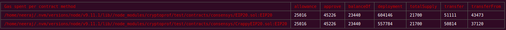

# cryptoprof: smart contract profiler

Any operation performed against any smart contract on the Ethereum blockchain incurs a gas cost
to the operator. This is what incentivizes miners to add transactions to mined blocks. It also
imposes an overhead cost on smart contract usage that is:

1. Easy to overlook.

2. Significant in its effects on the utility of the smart contract, especially if the contract is
intended to be used at scale.

Consider, for example, a hypothetical and absurd implementation of an ERC20 token in which
`transfer` and `transferFrom` calls are estimated to incur a total gas cost of 1 ETH. It is very
difficult to imagine a use that this token could be put to that could justify this cost of 1 ETH.
Even if such a use case did exist, it is hard to imagine such a token being used as a currency by
a large number of people today, when 1 ETH costs almost 600 US dollars. Let us take this as support
for the following:

**Proposition.** A high gas cost adversely affects the liquidity of a token.

If you buy into this proposition, then you should be very concerned with the gas cost incurred by
operations on any tokens you implement for use at scale and as currencies. In fact, this concern
should generalize beyond tokens to any smart contracts which are intended for general and frequent
use.

As we see token standards like [ERC20](https://github.com/ethereum/EIPs/blob/master/EIPS/eip-20.md)
and [ERC721](https://github.com/ethereum/EIPs/blob/master/EIPS/eip-721.md) rise in popularity (and
therefore in adoption), we are also seeing a corresponding increase in the number of implementations
of the interfaces those standards describe. As such, different implementations of the same token are
very difficult to compare to each other. For example, the decision of which ERC20 token
implementation you should use for your dapps is still a very subjective one and is generally based
on "what everyone else is doing".

We intend for `cryptoprof` to bring objectivity into such decision-making by allowing you to quickly
compare the gas usage for different implementations of the same standard.

It is important to understand that gas usage is not the only metric by which we should judge an
implementation of a given standard. It is generically true that greater security comes at greater
gas cost. The figure below shows a `cryptoprof` comparison of the Consensys reference implementation
of an ERC20 token with an insecure variant of that implementation (called `CrappyEIP20`):

The insecure implementation removes all overflow and balance checks from the Consensys
implementation. Sure, the `transferFrom` cost is substantially lower in terms of gas, but it comes
at a heavy cost in terms of exploitability. The onus is still on you, as a decision maker, to think
carefully about such trade-offs.

The above example of the Consensys ERC20 implementation in comparison to the crappy one shows,
though, how a tool like `cryptoprof` can be of use not only to people choosing *between*
implementations of standard contracts, but also to people *writing* implementations of these
contracts. If you are writing an ERC20 contract and your `transferFrom` gas cost is substantially
lower than that of the Consensys implementation (which is pretty minimal), you should probably
put on your bug goggles and go bug hunting.

`cryptoprof` currently supports the following standards:

+ ERC20

If you would like it to support another standard, do not hesitate to create an issue or submit
a pull request against this repository!

- - -

[HOME](https://github.com/doc-ai/cryptoprof)